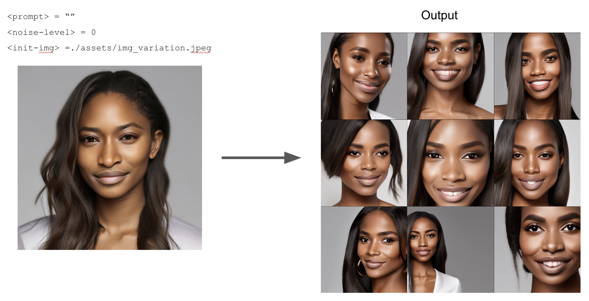
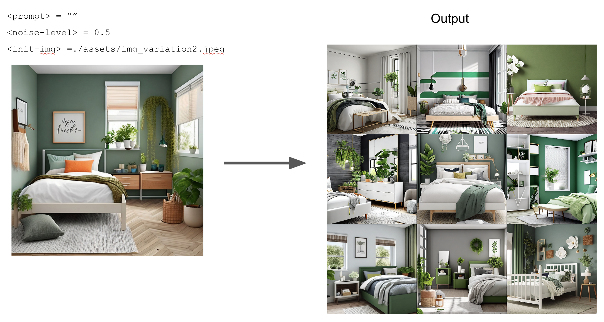
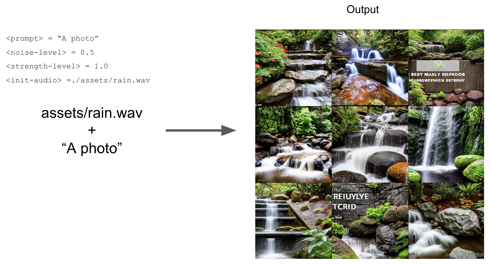
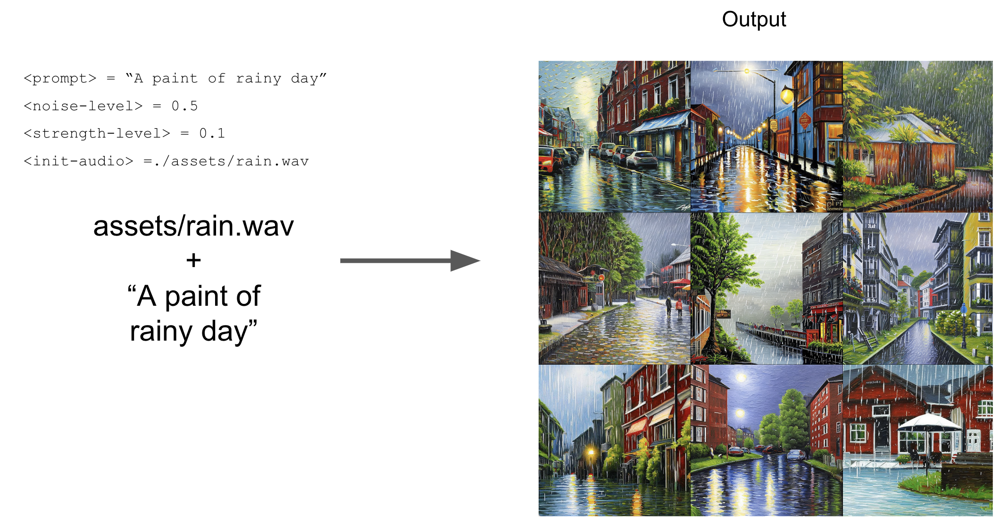
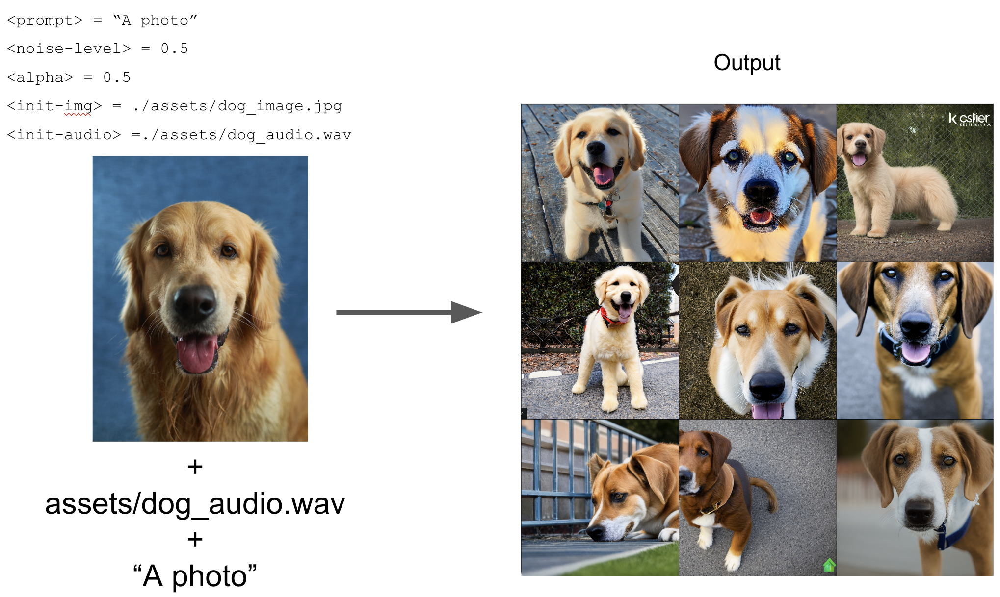
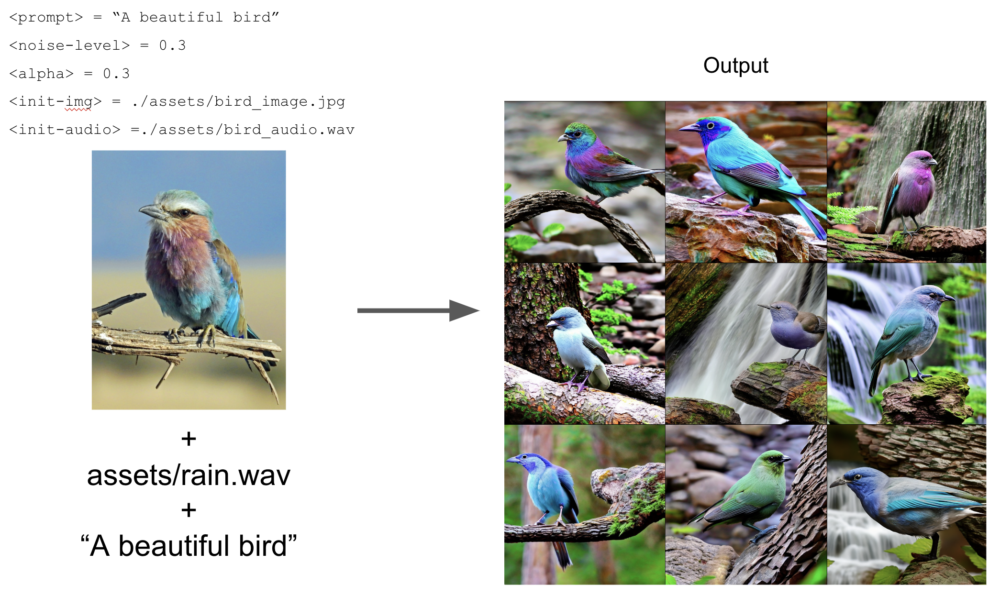

# BindDiffusion: One Diffusion Model to Bind Them All
Motivated by [ImageBind](https://github.com/facebookresearch/ImageBind), we realize that 
we can build a shared diffusion model conditioned on different modalities.

### Ongoing
- More modalities.
- Further fine-tuning for each modality. 
- Better way to fuse different modalities.

### Pretrained checkpoints
```
cd checkpoints;
wget https://huggingface.co/stabilityai/stable-diffusion-2-1-unclip/blob/main/sd21-unclip-h.ckpt;
wget https://dl.fbaipublicfiles.com/imagebind/imagebind_huge.pth;
```

### Image-conditioned generation:
```
python main_bind.py --prompt <prompt> --device cuda --modality image \
--H 768 --W 768 \
--config <init-config> --ckpt <init-ckpt> \
--noise-level <noise-level> --init <init-img> --strength <strength-level>
```



### Audio-conditioned generation:
```
python main_bind.py --prompt <prompt> --device cuda --modality audio \
--H 768 --W 768 \
--config <init-config> --ckpt <init-ckpt> \
--noise-level <noise-level> --init <init-audio>
```





### Naive mixed-modality generation:
```
python main_multi_bind.py --prompt "a photo" --device cuda \
--H 768 --W 768 \
--config <init-config> --ckpt <init-ckpt> \
--noise-level <noise-level> --init-image <init-img> --init-audio <init-audio> \
--alpha 0.5
```






### Acknowledgement
Thanks for these following amazing projects!

[Stable Diffusion](https://github.com/Stability-AI/stablediffusion),
[ImageBind](https://github.com/facebookresearch/ImageBind)
